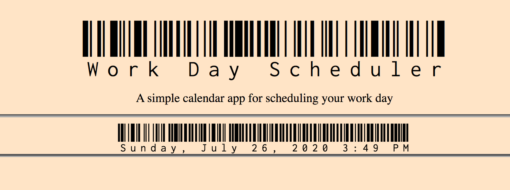

# Day Planner
Daily planner for user to plan out day by the hour. Color coded so user has visual if time block is in past, present, or future. User is able to store hourly plans in local storage.

### Current date and time is shown at top of page
<<<<<<< HEAD

=======
https://github.com/alihernandez/DayPlanner/issues/1#issue-665871123

>>>>>>> 3c9b7258400066b88713ba3b03c7899092ea6065
### If time block is in past it is shown as grey

### If time block is in present it is shown as red

### If time block is in future it is shown as green
<<<<<<< HEAD

=======
>>>>>>> 3c9b7258400066b88713ba3b03c7899092ea6065
